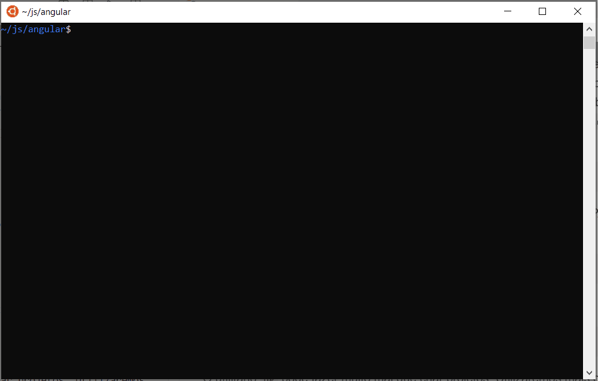
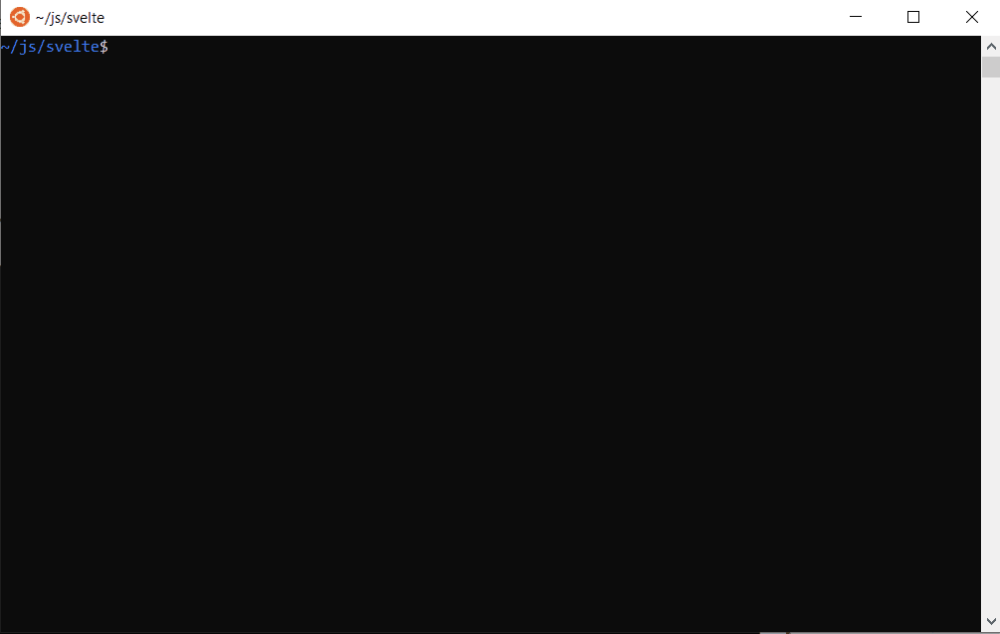

# Ambiente de desenvolvimento

Este curso irá trabalhar com 4 ferramentas de desenvolvimento: [React](https://pt-br.reactjs.org/), [Vue](https://vuejs.org/), [Angular](https://angular.io/) e [Svelte](https://svelte.dev/). É importante então que você prepare seu ambiente de trabalho para utilizá-las. Todas elas funcionam sobre o [Node](https://nodejs.org/), o que significa que é preciso instalá-lo antes de qualquer outra ferramenta. O curso prevê também que você desenvolva um projeto compartilhado com uma dupla (e o professor). Assim, é necessário ter o [Git](https://git-scm.com/) e um projeto compartilhado, seja no [Github](https://github.com/), [Bitbucket](https://bitbucket.org/) ou no [Gitlab](https://about.gitlab.com/) do [DIMAp](https://projetos.dimap.ufrn.br/) ou do [IMD](https://projetos.imd.ufrn.br/).

## Ferramentas básicas

### Node
O [Node](https://nodejs.org/) pode ser instalado de várias maneiras, mas vale a pena instalá-lo através do [NVM (Node Version Manager)](https://github.com/nvm-sh/nvm). Esse gerenciador permite que você execute uma versão local do Node, evitando problemas de segurança e permissões de admin nos pacotes globais (pacotes npm possuem dependências diretas e indiretas, por isso é melhor instalá-los sem permissão de admin).

Para instalar o NVM em um ambiente de linha de comando POSIX (Linux ou macOS) digite:

```
wget -qO- https://raw.githubusercontent.com/nvm-sh/nvm/v0.35.3/install.sh | bash
```

Este comando irá baixar os arquivos e instalar o executável em uma pasta local (`~/.nvm`). Após isso, você terá o comando `nvm` ao seu dispor. É possível que você tenha que abrir um novo terminal para que o comando esteja "visível" no PATH (o arquivo de configuração do shell, `.bashrc` ou similar, precisa ser executado novamente).

Caso você esteja no Windows, sugiro instalar o [Subsistema Windows para Linux (WSL)](https://docs.microsoft.com/pt-br/windows/wsl/install-win10). Com ele, você terá um ambiente Linux no seu Windows (usando virtualização). É nesse ambiente que as aplicações de demonstração deste curso serão desenvolvidas. Com o WSL instalado, a instalação do NVM segue os mesmos passos descrito anteriormente (afinal, é um ambiente Linux).

Caso não queira instalar o WSL (ou não possa, já que é necessário uma versão atualizada do Windows 10), sugiro instalar o [Git for Windows](https://gitforwindows.org/). Ele inclui o Git Bash, que emula o shell Bash e o NVM pode ser então instalado com o comando acima. Outra opção é instalar uma versão própria do [NVM para windows](https://docs.microsoft.com/pt-br/windows/nodejs/setup-on-windows).

Depois do NVM instalado, para instalar a última versão do Node e seu gerenciador de pacotes NPM (*Node Package Manager*) com o NVM, digite o seguinte na linha de comando:

```
nvm install node
```


Caso queria uma versão LTS (*Long Term Support*), utilize a opção `--lts` na linha de comando ou use no lugar de `node` um *alias* para uma de suas versões (`erbium` para a última versão LTS, v12.8.3).

### Git

Nas distribuições Linux, o Git já vem instalado por padrão. No macOS, se você instalou o XCode, é possível que o Git já tenha sido instalado também. No windows, caso não esteja utilizando o WSL, há uma versão específica, chamada [Git for Windows](https://gitforwindows.org/), que facilita a instalação do Git (além de incluir em emulador bash, Git Bash).


Crie um repositório para o desenvolvimento do projeto em uma das seguintes plataformas: [Github](https://github.com/), [Bitbucket](https://bitbucket.org/) ou no [Gitlab](https://about.gitlab.com/) do [DIMAp](https://projetos.dimap.ufrn.br/) ou do [IMD](https://projetos.imd.ufrn.br/).
O repositório pode ser tanto público quanto privado, desde que seja compartilhado com o usuário `amccampos` (é o mesmo para qualquer uma das plataformas).

### Editores

Há uma grande variedade de IDEs e editores de código disponíveis. Os mais utilizados são:
* [Visual Code](https://code.visualstudio.com/)
* [Atom](https://atom.io/)
* [Sublime](https://www.sublimetext.com/)
* [WebStorm](https://www.jetbrains.com/webstorm/)

Alguns desses editores precisarão instalar plugins para facilitar o uso de recursos específicos dos frameworks, como autocompletar e ter acesso a atributos e métodos de diferentes arquivos.


## Ferramentas de front-end

### React

[React](https://pt-br.reactjs.org/) é uma biblioteca a ser anexada à sua aplicação. Logo, sua inserção pode ser realizada de diferentes formas. Pode-se incluir a biblioteca diretamente no HTML principal da aplicação, a partir de um CDN (*Content Delivery Network*), como abaixo:

```html
<script src="https://unpkg.com/react@16/umd/react.development.js" crossorigin></script>
<script src="https://unpkg.com/react-dom@16/umd/react-dom.development.js" crossorigin></script>
```

Pode-se também configurar ferramentas de automação de tarefas e/ou empacotamento (gulp, webpack etc.) para empacotar o React com sua aplicação. Porém, a forma mais simples de iniciar é criar sua aplicação a partir de um template que já esteja com os empacotadores configurados. O template de aplicação mais utilizado é o `create-react-app`. Para criar uma aplicação com base nele, execute o comando abaixo:

```
npx create-react-app meu-app
```


Esse comando utiliza o utilitário `npx` (incluído no NPM) para baixar e executar o pacote `create-react-app`, que criará uma nova pasta com nome `meu-app` (mude o nome para o da sua aplicação) e vários arquivos serão baixados com o modelo de um projeto inicial React.

### Vue

O [Vue](https://vuejs.org/) também pode ser utilizado incluindo seus scripts diretamente no arquivo HTML, como abaixo.

```
<script src="https://cdn.jsdelivr.net/npm/vue/dist/vue.js"></script>
```

Entretanto, para grandes aplicações, o Vue possui um formato de arquivo especial (`.vue`), que facilita o empacotamento dos vários elementos da aplicação, mas que precisam ser transformados em `.js`.

Para isso, o Vue disponibiliza uma interface  de linha de comando ([Vue CLI](https://cli.vuejs.org/)) que fornece várias facilidades, entre elas a de criar novos projetos. Para instalar o Vue CLI globalmente, execute o comando abaixo (caso não tenha instalado Node via NVM, provavelmente precisará usar `sudo` antes do comando). Depois disso, veja se o comando `vue` está corretamente instalado verificando sua versão.

```
npm install -g @vue/cli

vue --version
```


Com o comando `vue` disponível, você pode agora criar novos projetos executando:

```
vue create meu-app
```

Antes de criar o projeto, ele apresentará várias opções (uso de babel, typescript, pre-processador CSS, LINT etc.). Ele criará depois os arquivos da aplicação conforme as opções selecionadas e instalará os pacotes NPM necessários.


Mais informações sobre as possibilidade da linha de comando do Vue podem ser consultadas no seu [site](https://cli.vuejs.org/).

### Angular

O [Angular](https://angular.io/) é fortemente baseado em [Typescript](https://www.typescriptlang.org/). Portanto, seus arquivos precisam ser transformados em Javascript antes de incluí-lo no HTML da aplicação. Assim, diferentemente de React e Vue, não é possível simplesmente inserir uma tag `<script>` no HTML para usar o Angular. É necessário um processo de compilação e empacotamento. Como o Vue, o Angular também possui uma ferramenta em linha de comando (CLI) para facilitar esse processo. Atualmente, esta a principal forma de se criar novos projetos.

Para instalar o CLI do Angular globalmente, execute o comando abaixo (caso não tenha instalado Node via NVM, provavelmente precisará usar `sudo` antes do comando). Se a instalação for bem sucedida, o utilitário `ng`estará disponível no seu PATH. Para confirmar, consulte a versão instalada através da operação `ng version`:

```
npm install -g @angular/cli

ng version
```



Você poderá então criar um novo projeto executando o comando abaixo. Como no CLI do Vue, o do Angular apresentará algumas opções. Essas e várias outras opções podem ser definidas através de parâmetros na linha de comando. O `ng` irá criar arquivos de uma aplicação padrão e instalar os pacotes NPM necessários.

```
ng new meu-app
```


O utilitário `ng` pode fazer muito mais que criar projetos. Utilizaremos mais opções dele ao longo do curso. Para maiores informações sobre opções e possibilidades da linha de comando visite seu [site](https://cli.angular.io/).


### Svelte

[Svelte](https://svelte.dev/) não é uma biblioteca ou framework como as ferramentas anteriores. É um compilador. Então, como o Angular, não é possível simplesmente incluir um arquivo através de uma tag `<script>`. É necessário que seus arquivos sigam um processo de compilação e empacotamento.

Diferentemente do Vue e Angular, o Svelte não possui uma ferramenta de linha de comando para auxiliar. Porém, como o React, pode-se criar um projeto através de um projeto template com ferramentas de compilação e empacota\mento já pré-configuradas.

O projeto modelo disponível no próprio repositório do Svelte pode ser baixado através do comando:

```
npx degit sveltejs/template meu-app
```

O `degit` irá criar uma cópia do repositório `sveltejs/template` do Github sem precisar baixar todas as alterações do repositório (*history*), tal como ocorre se você fizer um `git clone`.

Como o `degit` apenas faz a cópia do template, antes de começar a trabalhar no seu projeto, é necessário ir para a pasta criada e instalar os pacotes.

```
cd meu-app

npm install
```


