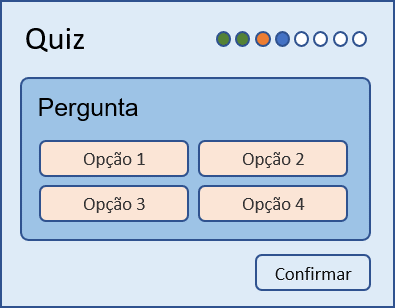
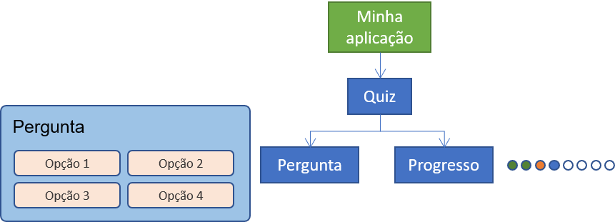

<!-- omit in toc -->
# Componentes

- [Principais conceitos](#principais-conceitos)
- [Projeto Quiz](#projeto-quiz)
- [Vantagens](#vantagens)
- [Para saber mais](#para-saber-mais)

## Principais conceitos

Na última década, as ferramentas de desenvolvimento do frontend tem migrado o foco para criação de elementos visuais reutilizáveis e reativos (às alterações do estado da aplicação), também conhecidos como **componentes**. Eles compõem a base da maioria das aplicações web modernas e permitem organizar melhor a elaboração de interfaces ricas e de fácil reuso.

Um componente é um elemento visual da sua interface web. Ou seja, ele possui um aspecto visual e um comportamento próprio, podendo ser configurado através de parâmetros (propriedades), gerar eventos e guardar informações (estado do componente).

Como essa definição é bem genérica, talvez fique mais fácil visualizar essas características através de elementos HTML que você já conhece, como o elemento `<input>` abaixo. Ele pode receber parâmetros, como `type` e `placeholder`, pode gerar eventos, como o evento `change` (capturado pela propriedade `onchange`), e possui um estado interno, armazenando entre outros o que o usuário digitou até o momento.

```html[.html]
<input type="text" placeholder="digite algo" onchange="doit()">
```
<input type="text" placeholder="digite algo" onchange="doit()">

<b-form-input class="mb-3" placeholder="digite algo"></b-form-input>

Porém, o número de elementos HTML que podemos usar nas nossas aplicações é bem limitado. Se quisermos utilizar um medidor como o apresentado na figura abaixo, não temos uma tag própria como exemplificada abaixo.

```html[.html]
<gauge value="120" max="200" onchange="doit()"></gauge>
```

Podemos criar, entretanto, um componente web com essa finalidade. Os componentes compartilham muitas das características dos elementos HTML, existindo inclusive uma API própria para se criar novos elementos HTML, também chamados de [custom elements](https://developer.mozilla.org/pt-BR/docs/Web/Web_Components/Usando_custom_elements), e que faz parte das tecnologias para se criar [Web Components](https://developer.mozilla.org/pt-BR/docs/Web/Web_Components). Vale salientar, porém, que o conceito de **componente web** apresentado aqui é mais geral que o de Web Components. Este é apenas uma das forma de se implementar componentes web. Há outras formas. O React, por exemplo, utiliza um [DOM virtual](https://pt-br.reactjs.org/docs/faq-internals.html) para gerenciar seus componentes na aplicação que não usa o [Shadow DOM](https://developer.mozilla.org/pt-BR/docs/Web/Web_Components/Using_shadow_DOM) especificado para o Web Component.

Uma das grande vantagens de se criar aplicações web baseadas em componentes é a possibilidade de definir novos elementos visuais e usá-los para compor uma página. Outra grande vantagem advém da versatilidade dos componentes, que podem assumir tanto a forma de elementos interativos (como o gauge) quanto em forma de containers, definindo o layout de um ou mais elementos. O layout abaixo pode ser definido por um componente. Debaixo dele (na hierarquia), podem também existir outros componentes, e assim por diante. Ou seja, tudo pode ser componente... e reutilizável.

Para facilitar a compreensão, iremos apresentar vários dos conceitos abordados no curso a partir do desenvolvimento de uma aplicação exemplo: Quiz.


## Projeto Quiz

O Quiz é uma aplicação simples que servirá de exemplo ao longo do curso, pois atende bem ao nosso propósito: ilustrar conceitos gerais. O primeiro conceito é que componentes podem ser compostos de outros componentes. Logo, há uma hierarquia. Eles são, na verdade, inseridos (direto ou indiretamente) no DOM e obedecem à estrutura hierárquica do DOM. Então, há *componentes-pai* e *componentes-filho*. Eles podem se comunicar entre si, normalmente através de propriedades (dados que o pai passa para o filho) e eventos (dados que o filho gera e o pai pode capturar).

Para ilustrar, considere um quiz como o da imagem abaixo. Nele, há uma sequência de perguntas a serem feitas para o usuário, que pode acompanhar seu progresso através de uma "barra de progresso" na parte de cima do quiz. Cada pergunta possui um conjunto de quatro opções para o usuário escolher e depois confirmar a escolha. Em função da opção escolhida, a barra de progresso é atualizada com uma cor correspondente (verde para as respostas corretas e laranja para as erradas). Depois, uma nova pergunta é apresentada até que se chegue à última pergunta.



Esse quiz pode ser parte integrante de vários tipos de aplicações. Pode ser uma aplicação própria para quizzes, uma aplicação de ensino que intercala conteúdos com um quiz, uma aplicação de avaliação online e assim por diante. Ou seja, o quiz pode ser um componente reutilizável.

Quem vai usar esse componente poderia passar para ele a sequência de perguntas e alguns possíveis parâmetros para configurá-lo, tais como se o usuário pode voltar a uma pergunta previamente respondida, se o usuário terá acesso a um feedback logo após a resposta ou se será apenas no final do quiz (com um resumo de todas respostas), entre outros. Algo como exemplificado abaixo.

```html[app.html]
<quiz questions="..." config="..."></quiz>
```

O componente pode também devolver a quem o está utilizando quantas perguntas já foram respondidas, quantas estavam certas, quanto tempo o usuário levou em cada questão, e assim por diante. Isso é normalmente feito capturando eventos que o componente gera. No exemplo abaixo, capturamos quando o usuário responde algo (`onanswered`) e quando o usuário termina de responder todas as questões (`onfinished`).

```html[app.html]
<quiz questions="..." config="..." onanswered="..." onfinished="..."></quiz>
```

Assim, sempre que precisarmos apresentar um quiz para o usuário, podemos simplesmente usar o componente `quiz` com diferentes parâmetros e realizando diferentes ações com as respostas dados.

O componente quiz, por sua vez, também pode ser composto por outros componentes. Ele possui pelo menos dois elementos visualmente distintos e com comportamentos bem diferentes: a pergunta propriamente dita, com suas possíveis respostas, e a barra de progresso, como mostra a figura abaixo. Da mesma forma do componente quiz, esses componentes podem receber parâmetros para configurá-los e enviar enviar dados para quem os usa (no caso, o componente quiz).



Assim, o quiz pode ser definido por algo similar ao trecho de código abaixo. Vale salientar que a forma como isso será, de fato, posto em prática depende da ferramenta utilizada (React, Vue, Angular e Svelte possuem sintaxes diferentes). O código exposto serve apenas para ilustrar o conceito.

```html[quiz.html]
<question statement="..." options="..." onanswered="..."></question>
<progress total="..." answered="..." current="..."></progress>
```

O componente Pergunta pode receber como parâmetro o enunciado da questão e suas possíveis respostas. Ele se apresenta ao usuário, inicialmente sem opção escolhida, e sempre que o usuário escolher uma opção, ele a informa ao seu pai (quiz). A barra de progresso também possui um aspecto visual próprio, que deve ser apresentado ao usuário e que depende do número de questões envolvidas, quais foram respondidas e, caso respondida, quais estavam certas e quais estavam erradas. A princípio, não há nenhum dado para ele passar ao pai (quiz).

O fato de um componente poder ser composto de outros componentes permite que uma aplicação toda seja construída na base de componentes... e é assim que ocorre na maioria das Aplicações de Página Única ([SPA - Single Page Applications](https://en.wikipedia.org/wiki/Single-page_application)).

## Vantagens

O interessante de se projetar aplicações baseadas em componentes é a clara **separação de interesses** que essa abordagem promove, incentivando modularidade e abstração. Para o desenvolvedor, isso facilita a manutenção e reuso de código, e para o designer, isso facilita a composição de aplicações usando componentes já existentes, como num lego, que juntamos peças para compor um objeto maior.

O componente quiz, por exemplo, recebe as perguntas que deve fazer... e não depende de mais nada para funcionar. Não depende de outras partes da aplicação. Aliás, o quiz não precisa nem "saber" se faz parte de alguma aplicação. Neste exemplo, as informações são guardadas no "estado" do componente. Esse estado é gerenciado pelo próprio componente e compartilhado com seus filhos: Pergunta e Progresso. Estes, por sua vez, não precisam nem saber que fazem parte de um quiz. Eles só precisam receber os parâmetros necessários e atuar como esperado.

Claro que numa aplicação web mais complexa haverá muitos outros conceitos e elementos envolvidos. Guardar o estado aplicação apenas nos seus componentes pode ser uma opção inviável. Talvez guardar o estado e compartilhá-lo com vários elementos permita que uma informação esteja presente e atualizada em diferentes partes de uma página da aplicação. É possível também que os dados da aplicação sejam provenientes de um servidor ou que precisem persistir nele. Esses e outros elementos serão tratados mais adiante no curso. Por enquanto, o uso de componentes forma a base sobre a qual os outros elementos agem.

## Para saber mais

* [The Right Way to Implement Component-based Design Systems](https://envylabs.com/insights/web-application-design-system-guide/)
* [Web Component Based Architecture](https://medium.com/@smarth55/web-component-based-architecture-8837052b9e50)
* [Pensando do jeito React](https://pt-br.reactjs.org/docs/thinking-in-react.html) (é o mesmo jeito de pensar Vue, Angular, Svelte etc.)